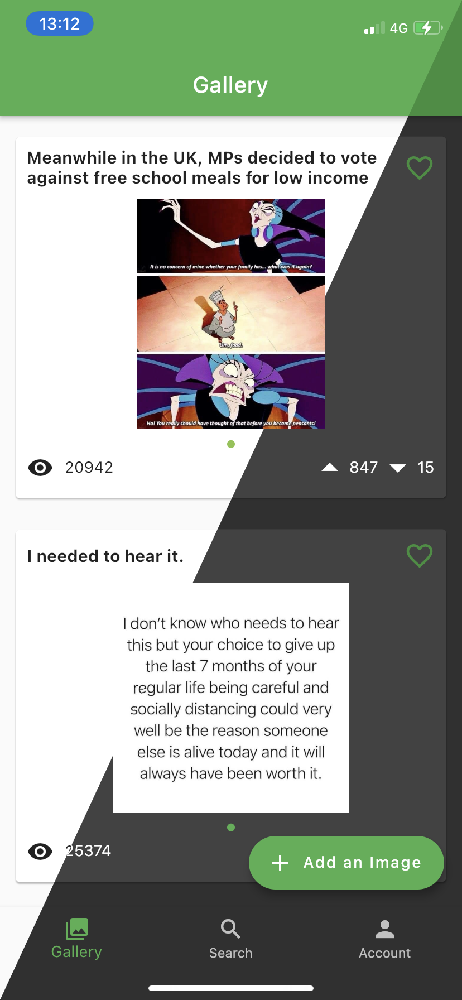
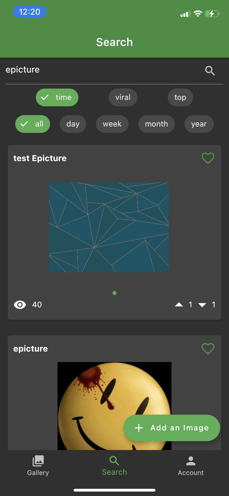
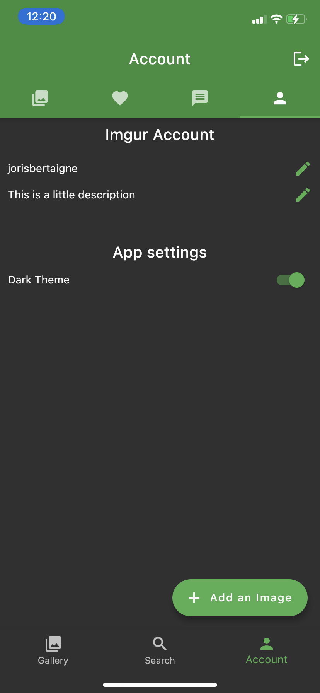

# 📸 Epicture

Epicture is an Epitech project. The goal was to create an [Imgur](https://imgur.com) mobile client.

```
The project’s functionalities are set out as follows:
  • Imgur API implementation
  • Authenticate to the Imgur platform
  • Display the photos put online by the user connected
  • Search for photos on the plateform
  • Upload photos to the plateform
  • Manage your favorites
  • Filter the displayed photos
```

## Getting Started

### Prerequisites

- You'll need to have [Dart SDK](https://dart.dev/get-dart) and [Flutter](https://flutter.dev/docs/get-started/install) installed.
- If you want to build or run the application for an iOS device, you'll need a Mac.

### Features

- Gallery
- Search (with search bar and different filters)
- Account (with your posts, comments, favorites images and informations)

If you're logged in, you can also:

- View and manage your favorites
- Up vote / down vote a post
- Add comments / replies
- Upload images
- Change your Imgur informations
- Change appearance (light and dark mode available)

## Installation

To install Epicture to your phone, you'll have to build a Flutter app.
In order to use the Imgur API, you have to provide a `ClientID`.
You can found all the informations about the Imgur API [here](https://apidocs.imgur.com).

Build for Android:

```sh
$ flutter build apk --dart-define=CLIENT_ID=$CLIENTID
```

Build for iOS:

```sh
$ flutter build ios --dart-define=CLIENT_ID=$CLIENTID
```

Once the project is build, you can install it to your phone:

```sh
$ flutter install
```

All informations about the build and install methods are availiable [here for Android](https://flutter.dev/docs/deployment/android) and [here for iOS](https://flutter.dev/docs/deployment/ios).

## Documentation

Technical and user documentation can be found in the repository in the `doc` folder.

## Screenshots

| 🌃 Gallery                    | 🔎 Search                    | ⚙️ Settings                    |
| ----------------------------- | ---------------------------- | ------------------------------ |
|  |  |  |

## Authors

- [Joris Bertaigne](https://github.com/b-joris)
- [Elias El-Fallah](https://github.com/EliasElFallah)

## License

MIT
